---
## Front matter
lang: ru-RU
title: Лабораторная работа №1
subtitle: Математическое моделирование 
author:
  -  Зиязетдинов А.Р.

## i18n babel
babel-lang: russian
babel-otherlangs: english

## Formatting pdf
toc: false
toc-title: Содержание
slide_level: 2
aspectratio: 169
section-titles: true
theme: metropolis
header-includes:
 - \metroset{progressbar=frametitle,sectionpage=progressbar,numbering=fraction}
 - '\makeatletter'

 - '\makeatother'
---

## Докладчик

:::::::::::::: {.columns align=center}
::: {.column width="70%"}

  * Зиязетдинов Алмаз Радикович
  * НПИбд-01-22
 

:::
::: {.column width="30%"}

:::
::::::::::::::

## Цели и задачи

- Приобрести практические навыки работы с системой управления версиями Git.

# Выполнение лабораторной работы

## Подготовка

{#fig:001 width=70%}

## Создание проекта

{#fig:002 width=70%}

## Внесение изменений

{#fig:003 width=70%}

## Индексация изменений

{#fig:004 width=70%}

## Индексация изменений

{#fig:005 width=70%}

## Индексация изменений

{#fig:006 width=70%}

## Индексация изменений

{#fig:007 width=50%}

## Индексация изменений

{#fig:008 width=70%}

## История

{#fig:009 width=50%}

## История

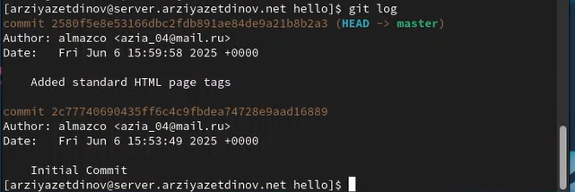{#fig:010 width=50%}

## Создание тегов версий

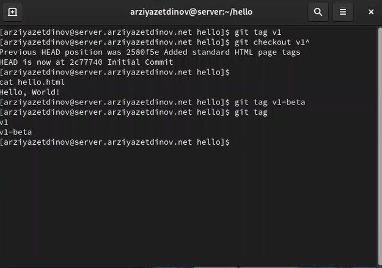{#fig:011 width=40%}

## Создание тегов версий

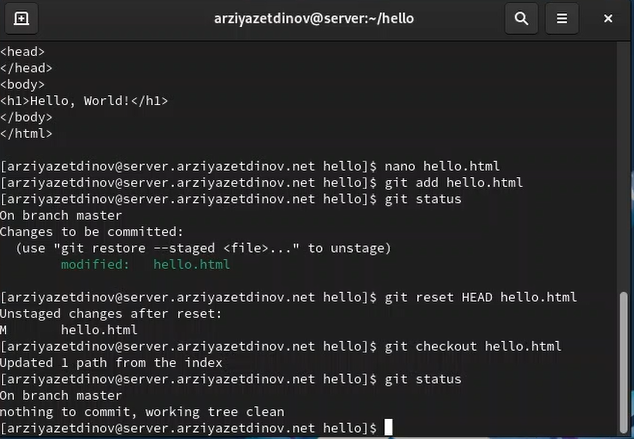{#fig:012 width=50%}

## Отмена локальных изменений (до индексации)

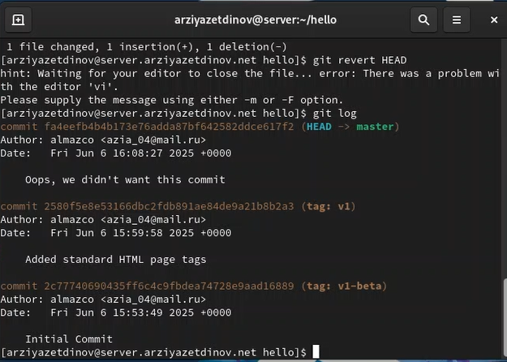{#fig:013 width=70%}

## Отмена локальных изменений (до индексации)

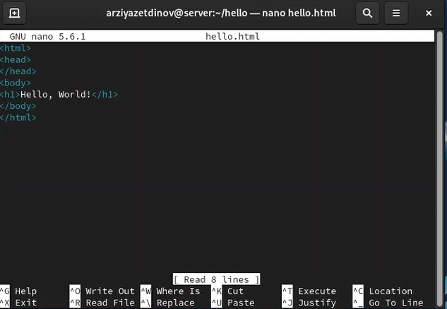{#fig:014 width=70%}

## Отмена проиндексированных изменений (перед коммитом)

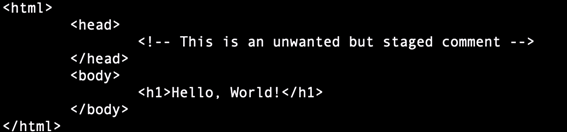{#fig:015 width=70%}

## Отмена проиндексированных изменений (перед коммитом)

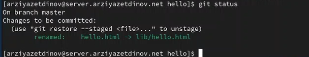{#fig:016 width=50%}

## Отмена коммитов

![Отмена коммитов]

## Отмена коммитов

![Редактор]

## Удаление коммиттов из ветки

## Git внутри: Каталог .git

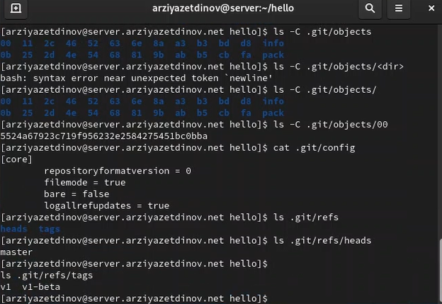{#fig:028 width=70%}

## Работа непосредственно с объектами git

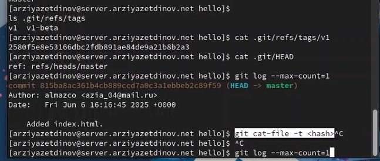{#fig:029 width=50%}

## Создание ветки

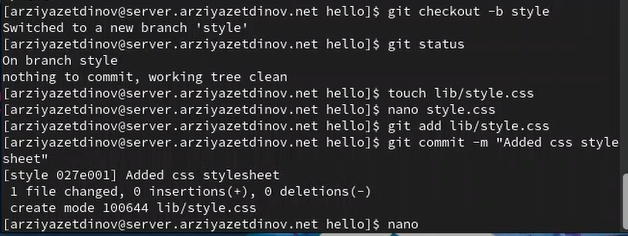{#fig:030 width=70%}

## Создание ветки

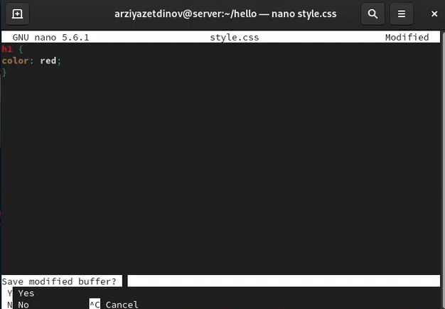{#fig:031 width=70%}

## Создание ветки

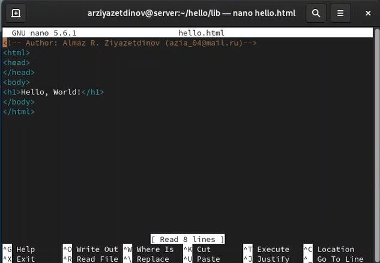{#fig:032 width=70%}

## Навигация по веткам

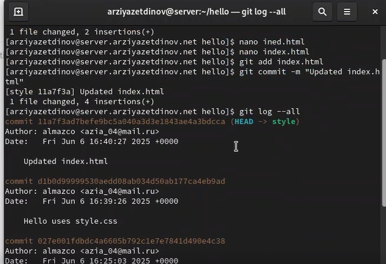{#fig:033 width=30%}

## Навигация по веткам

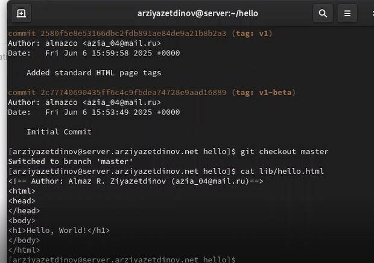{#fig:034 width=70%}

## Изменения в ветке main

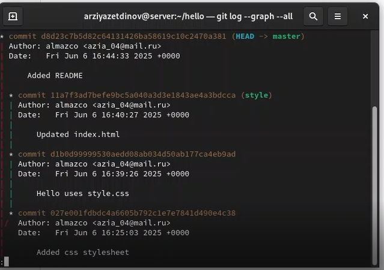{#fig:035 width=35%}

## Слияние

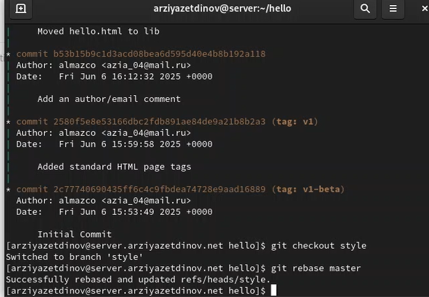{#fig:036 width=35%}

## Сброс ветки main

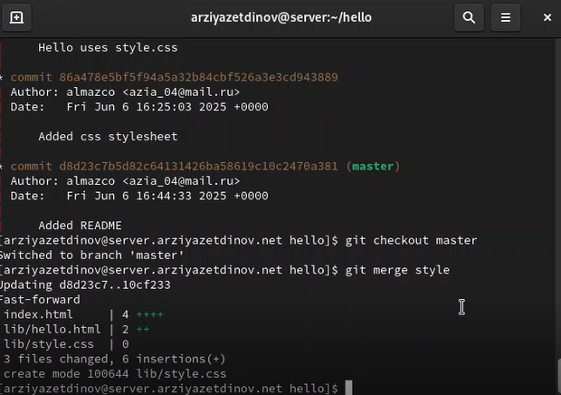{#fig:044 width=25%}

## Сброс ветки main

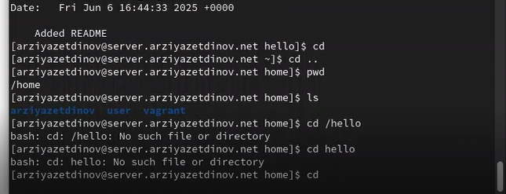{#fig:049 width=50%}

## Изменение оригинального репозитория

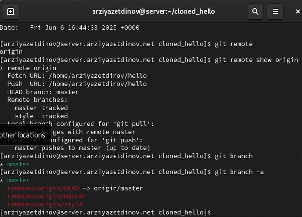{#fig:054 width=70%}

## Создайте чистый репозиторий

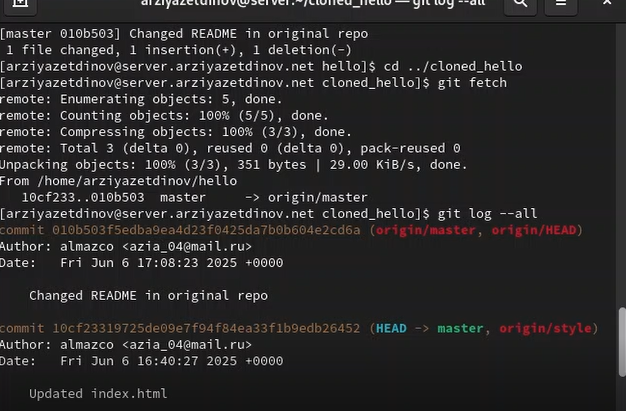{#fig:057 width=70%}

## Вывод

- В ходе выполнения данной лабораторной работы я приобрела практические навыки работы с системой управления версиями Git.