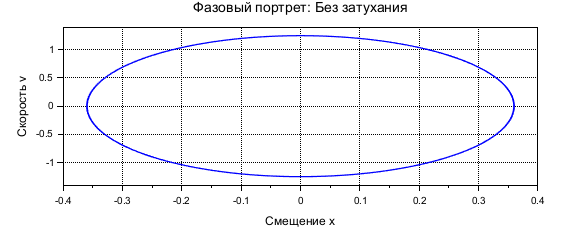
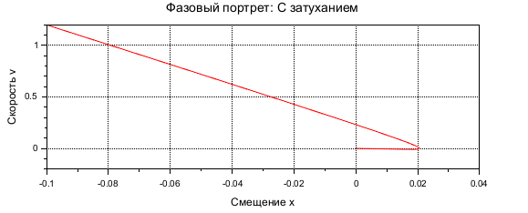
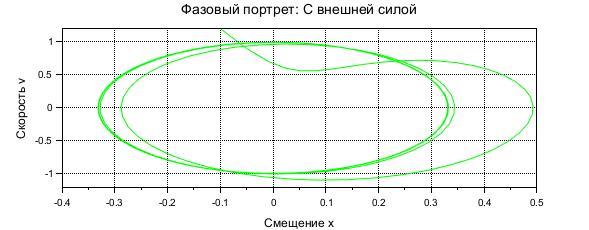
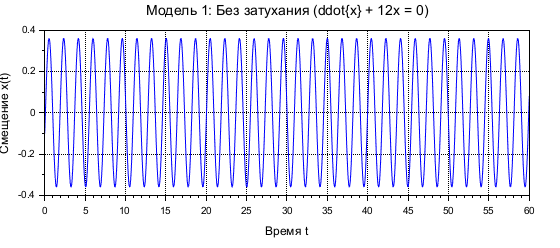
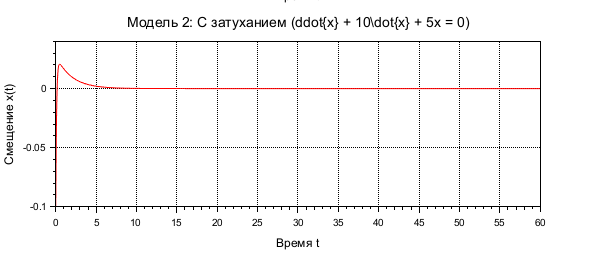

---
# Front matter
lang: ru-RU
title: "Отчет по лабораторной работе №3"
subtitle: "Модель боевых действий - вариант 11"
author: "Зиязетдинов Алмаз Радикович"

# Formatting
toc-title: "Содержание"
toc: true # Table of contents
toc_depth: 2
lof: true # List of figures
fontsize: 12pt
linestretch: 1.5
papersize: a4paper
documentclass: scrreprt
polyglossia-lang: russian
polyglossia-otherlangs: english
mainfont: PT Serif
romanfont: PT Serif
sansfont: PT Sans
monofont: PT Mono
mainfontoptions: Ligatures=TeX
romanfontoptions: Ligatures=TeX
sansfontoptions: Ligatures=TeX,Scale=MatchLowercase
monofontoptions: Scale=MatchLowercase
indent: true
pdf-engine: lualatex
header-includes:
  - \linepenalty=10 # the penalty added to the badness of each line within a paragraph (no associated penalty node) Increasing the υalue makes tex try to haυe fewer lines in the paragraph.
  - \interlinepenalty=0 # υalue of the penalty (node) added after each line of a paragraph.
  - \hyphenpenalty=50 # the penalty for line breaking at an automatically inserted hyphen
  - \exhyphenpenalty=50 # the penalty for line breaking at an explicit hyphen
  - \binoppenalty=700 # the penalty for breaking a line at a binary operator
  - \relpenalty=500 # the penalty for breaking a line at a relation
  - \clubpenalty=150 # extra penalty for breaking after first line of a paragraph
  - \widowpenalty=150 # extra penalty for breaking before last line of a paragraph
  - \displaywidowpenalty=50 # extra penalty for breaking before last line before a display math
  - \brokenpenalty=100 # extra penalty for page breaking after a hyphenated line
  - \predisplaypenalty=10000 # penalty for breaking before a display
  - \postdisplaypenalty=0 # penalty for breaking after a display
  - \floatingpenalty = 20000 # penalty for splitting an insertion (can only be split footnote in standard LaTeX)
  - \raggedbottom # or \flushbottom
  - \usepackage{float} # keep figures where there are in the text
  - \floatplacement{figure}{H} # keep figures where there are in the text
---

# Цель работы

Рассмотрим некоторые простейшие модели боевых действий – модели Ланчестера. В противоборстве могут принимать участие, как регулярные войска, так и партизанские отряды. В общем случае главной характеристикой соперников являются численности сторон. Если в какой-то момент времени одна из численностей обращается в нуль, то данная сторона считается проигравшей (при условии, что численность другой стороны в данный момент положительна). 

# Задание

1. Изучить три случае модели Ланчестера
2. Построить графики изменения численности войск 
3. Определить победившую сторону

# Выполнение лабораторной работы

## Теоретические сведения

Рассмотри три случая ведения боевых действий: 
1. Боевые действия между регулярными войсками 
2. Боевые действия с участием регулярных войск и партизанских отрядов 
3. Боевые действия между партизанскими отрядами 

В первом случае численность регулярных войск определяется тремя факторами:

1. скорость уменьшения численности войск из-за причин, не связанных с боевыми действиями (болезни, травмы, дезертирство);
2. скорость потерь, обусловленных боевыми действиями противоборствующих сторон (что связанно с качеством стратегии, уровнем вооружения, профессионализмом солдат и т.п.);
3. скорость поступления подкрепления (задаётся некоторой функцией от времени). 

В этом случае модель боевых действий между регулярными войсками описывается следующим образом

$$
 \begin{cases}
	\frac{dx}{dt}= -a(t)x(t) - b(t)y(t) + P(t)
	\\   
	\frac{dy}{dt}= -c(t)x(t) - h(t)y(t) + Q(t)
 \end{cases}
$$

Потери, не связанные с боевыми действиями, описывают члены $–a(t)x(t)$ и $–h(t)y(t)$, члены $–b(t)y(t)$ и $–c(t)x(t)$ отражают потери на поле боя. Коэффициенты $b(t)$, $c(t)$ указывают на эффективность боевых действий со стороны $y$ и $x$ соответственно, $a(t)$,$h(t)$  - величины, характеризующие степень влияния различных факторов на потери. Функции $P(t)$,$Q(t)$  учитывают возможность подхода подкрепления к войскам $X$ и $Y$ в течение одного дня. 

Во втором случае в борьбу добавляются партизанские отряды. Нерегулярные войска в отличии от постоянной армии менее уязвимы, так как действуют скрытно, в этом случае сопернику приходится действовать неизбирательно, по площадям, занимаемым партизанами. Поэтому считается, что темп потерь партизан, проводящих свои операции в разных местах на некоторой известной территории, пропорционален не только численности армейских соединений, но и численности самих партизан. В результате модель принимает вид:

$$
 \begin{cases}
	\frac{dx}{dt}= -a(t)x(t) - b(t)y(t) + P(t)
	\\   
	\frac{dy}{dt}= -c(t)x(t)y(t) - h(t)y(t) + Q(t)
 \end{cases}
$$

Модель ведение боевых действий между партизанскими отрядами с учетом предположений, сделанном в предыдущем случаем, имеет вид:

$$
 \begin{cases}
	\frac{dx}{dt}= -a(t)x(t) - b(t)x(t)y(t) + P(t)
	\\   
	\frac{dy}{dt}= -h(t)y(t) - c(t)x(t)y(t) + Q(t)
 \end{cases}
$$

В простейшей модели борьбы двух противников коэффициенты $b(t)$ и $c(t)$ являются постоянными. Попросту говоря, предполагается, что каждый солдат армии $x$ убивает за единицу времени $c$ солдат армии $y$ (и, соответственно, каждый солдат армии $y$ убивает $b$ солдат армии $x$). Также не учитываются потери, не связанные с боевыми действиями, и возможность подхода подкрепления. Состояние системы описывается точкой $(x,y)$ положительного квадранта плоскости. Координаты этой точки, $x$ и $y$ - это численности противостоящих армий. Тогда модель принимает вид

$$
 \begin{cases}
	\frac{dx}{dt}= -by
	\\   
	\frac{dy}{dt}= -ax
 \end{cases}
$$

Это - жесткая модель, которая допускает точное решение

$\frac{dx}{dy}=\frac{by}{cx}$

$cxdx=bydy, cx^2 - by^2 = C$

Эволюция численностей армий x и y происходит вдоль гиперболы, заданной этим уравнением (рис. -@fig:001). По какой именно гиперболе пойдет война, зависит от начальной точки.

{ #fig:001 width=70% height=70% }

Эти гиперболы разделены прямой  $\sqrt{cx}=\sqrt{by}$. Если начальная точка лежит выше этой прямой, то гипербола выходит на ось $y$. Это значит, что в ходе войны численность армии $x$ уменьшается до нуля (за конечное время). Армия $y$ выигрывает, противник уничтожен. 
Если начальная точка лежит ниже, то выигрывает армия $x$. В разделяющем эти случаи состоянии (на прямой) война заканчивается истреблением обеих армий. Но на это требуется бесконечно большое время: конфликт продолжает тлеть, когда оба противника уже обессилены. 
Вывод модели таков: для борьбы с вдвое более многочисленным противником нужно в четыре раза более мощное оружие, с втрое более многочисленным - в девять раз и т. д. (на это указывают квадратные корни в уравнении прямой). 
Стоит помнить, что эта модель сильно идеализирована и неприменима к реальной ситуации. Но может использоваться для начального анализа. 
Если рассматривать второй случай (война между регулярными войсками и партизанскими отрядами) с теми же упрощениями, то модель принимает вид:

$$
 \begin{cases}
	\frac{dx}{dt}= -by(t)
	\\   
	\frac{dy}{dt}= -cx(t)y(t)
 \end{cases}
$$

Эта система приводится к уравнению $\frac{d}{dt}= (\frac{b}{2}x^2(t)-cy(t))=0$
которое при заданных начальных условиях имеет единственное решение:
$\frac{b}{2}x^2(t)-cy(t)=\frac{b}{2}x^2(0)-cy(0)=C_1$

{ #fig:002 width=70% height=70% }

Из Рисунка @fig:002 видно, что при $C_1>0$ побеждает регулярная армия, при $C_1<0$ побеждают партизаны. Аналогично противоборству регулярных войск, победа обеспечивается не только начальной численностью, но и боевой выручкой и качеством вооружения. При $C_1>0$  получаем соотношение  $\frac{b}{2}x^2(0)>cy(0)$ Чтобы одержать победу партизанам необходимо увеличить коэффициент $c$ и повысить свою начальную численность на соответствующую величину. Причем это увеличение, с ростом начальной численности регулярных войск $x(0)$ должно расти не линейно, а пропорционально второй степени $x(0)$ . Таким образом, можно сделать вывод, что регулярные войска находятся в более выгодном положении, так как неравенство для них выполняется прим меньшем росте начальной численности войск.
Рассмотренные простейшие модели соперничества соответствуют системам обыкновенных дифференциальных уравнений второго порядка, широко распространенным при описании многих естественно научных объектов.


## Задача

Между страной $X$ и страной $Y$ идет война. Численность состава войск исчисляется от начала войны, и являются временными функциями $x(t)$ и $y(t)$
В начальный момент времени страна $X$ имеет армию численностью 52000 человек, 
а в распоряжении страны $Y$ армия численностью в 49000 человек.
Для упрощения модели считаем, что коэффициенты $a, b, c, h$ постоянны. 
Также считаем $P(t), Q(t)$ непрерывные функции.
Постройте графики изменения численности войск армии $X$ и армии $Y$ для следующих случаев:

1. Модель боевых действий между регулярными войсками

$$
 \begin{cases}
	\frac{dx}{dt}= -0.36x(t) - 0.48y(t) + sin(t+1)+1
	\\   
	\frac{dy}{dt}= -0.49x(t) - 0.37y(t) + cos(t+2)+1.1
 \end{cases}
$$

{ #fig:003 width=70% height=70% }


Победа достается армии $X$.

2. Модель ведение боевых действий с участием регулярных войск и партизанских отрядов

$$
 \begin{cases}
	\frac{dx}{dt}= -0.11(t) - 0.68y(t) + sin(5t)+1.1
	\\   
	\frac{dy}{dt}= -0.6x(t)y(t) - 0.15y(t) + cos(5t)+1
 \end{cases}
$$

{ #fig:005 width=70% height=70% }

{ #fig:006 width=70% height=70% }

Победа достается армии $X$.

```

## Код программы (Scilab)
// Начальные условия
x0 = 120000; // Начальная численность армии X
y0 = 90000;  // Начальная численность армии Y

// Временной интервал
t = linspace(0, 50, 1000);

// Функции подкрепления
function p = P(t)
    p = sin(2*t);
endfunction

function q = Q(t)
    q = cos(2*t);
endfunction

// Модель 1: Бой между регулярными войсками
function dydt = model1(t, y)
    x = y(1);
    y1 = y(2);
    dx_dt = -0.62 * x - 0.68 * y1 + P(t);
    dy_dt = -0.59 * x - 0.71 * y1 + Q(t);
    dydt = [dx_dt; dy_dt];
endfunction

// Модель 2: Бой между регулярными войсками и партизанами
function dydt = model2(t, y)
    x = y(1);
    y1 = y(2);
    dx_dt = -0.38 * x - 0.68 * y1 + P(t);
    dy_dt = -0.21 * x * y1 - 0.71 * y1 + Q(t);
    dydt = [dx_dt; dy_dt];
endfunction

// Решение дифференциальных уравнений
y0 = [x0; y0];
solution1 = ode(y0, 0, t, model1);
solution2 = ode(y0, 0, t, model2);

// Функция для определения победителя
function winner = determine_winner(solution, t, threshold)
    x = solution(1,:);
    y = solution(2,:);
    winner = "Бой продолжается до конца интервала времени";
    for i = 1:length(t)
        if x(i) <= threshold & y(i) > threshold then
            winner = "Армия Y побеждает в момент времени t=" + string(t(i));
            break;
        elseif y(i) <= threshold & x(i) > threshold then
            winner = "Армия X побеждает в момент времени t=" + string(t(i));
            break;
        elseif x(i) <= threshold & y(i) <= threshold then
            winner = "Обе армии уничтожены";
            break;
        end
    end
endfunction

// Построение графиков
scf(1); clf();
subplot(2,1,1);
plot(t, solution1(1,:), 'b', t, solution1(2,:), 'r');
xtitle('Модель 1: Бой между регулярными войсками', 'Время', 'Численность');
legend('Армия X (регулярная)', 'Армия Y (регулярная)');
xgrid();
disp("Модель 1: " + determine_winner(solution1, t, 0));

subplot(2,1,2);
plot(t, solution2(1,:), 'b', t, solution2(2,:), 'r');
xtitle('Модель 2: Бой между регулярными войсками и партизанами', 'Время', 'Численность');
legend('Армия X (регулярная)', 'Армия Y (партизаны)');
xgrid();
disp("Модель 2: " + determine_winner(solution2, t, 0));

// Условия победы
disp("");
disp("Условия победы:");
disp("Модель 1: Победа определяется соотношением начальных численностей и коэффициентов потерь.");
disp("  - Упрощённое аналитическое условие (без подкреплений): армия X побеждает, если 0.59*x0^2 > 0.68*y0^2.");
disp("  - С подкреплениями sin(2t) и cos(2t) результат зависит от динамики численности и эффективности.");
disp("    В данном случае: x0 = 120000, y0 = 90000, 0.59*(120000^2) = 8.496e9, 0.68*(90000^2) = 5.508e9.");
disp("    Так как 8.496e9 > 5.508e9, армия X имеет преимущество, но подкрепления могут изменить исход.");
disp("Модель 2: Регулярная армия (X) побеждает, если 0.68*x0^2 > 0.21*y0^2 (аналитическое условие).");
disp("  - Партизанам (Y) требуется значительно большая численность или эффективность для победы.");
disp("    В данном случае: 0.68*(120000^2) = 9.792e9, 0.21*(90000^2) = 1.701e9.");
disp("    Так как 9.792e9 > 1.701e9, регулярная армия X имеет значительное преимущество.");
disp("  - Подкрепления sin(2t) и cos(2t) могут повлиять на динамику, но преимущество X сохраняется.");
```

# Выводы

В результате проделанной лабораторной работы мы познакомились с моделью «Войны и сражения». 
Проверили, как работает модель в различных ситуациях, построили графики $y(t)$ и $x(t)$ в рассматриваемых случаях.

# Список литературы {.unnumbered}

1. [Законы Осипова — Ланчестера](https://ru.wikipedia.org/wiki/Законы_Осипова_—_Ланчестера)
2. [Дифференциальные уравнения динамики боя](https://zen.yandex.ru/media/id/5fd3c685994c494848984b63/differencialnye-uravneniia-dinamiki-boia-5fd4bcc45a2c8e1f2cc208f1)
3. [Элементарные модели боя](https://intuit.ru/studies/educational_groups/594/courses/499/lecture/11353?page=7)
