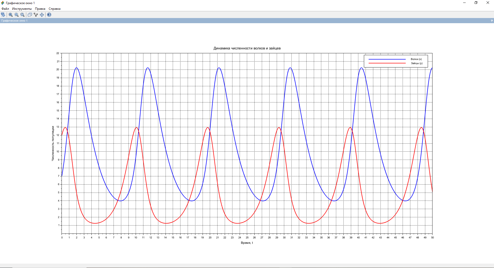
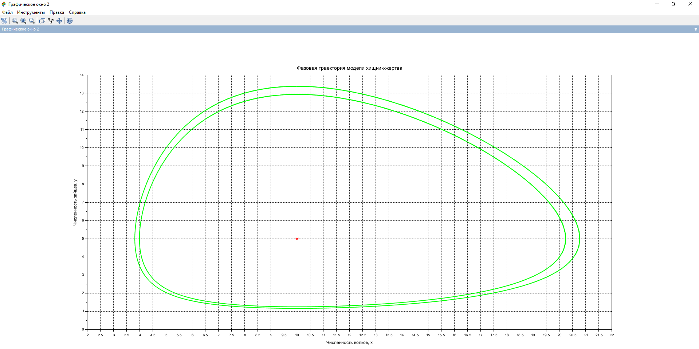
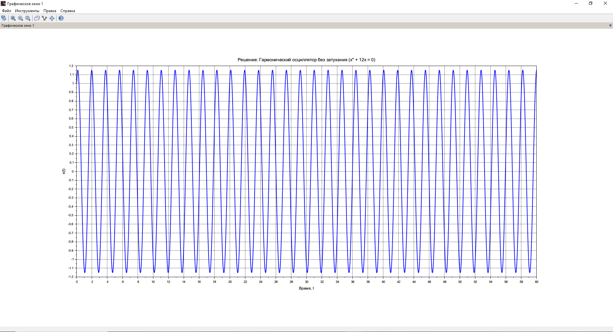
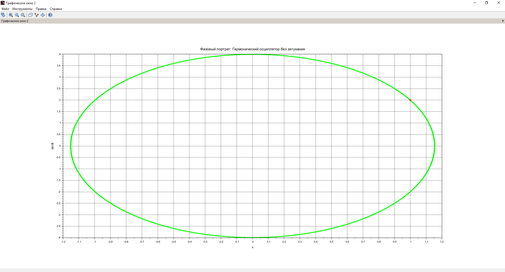
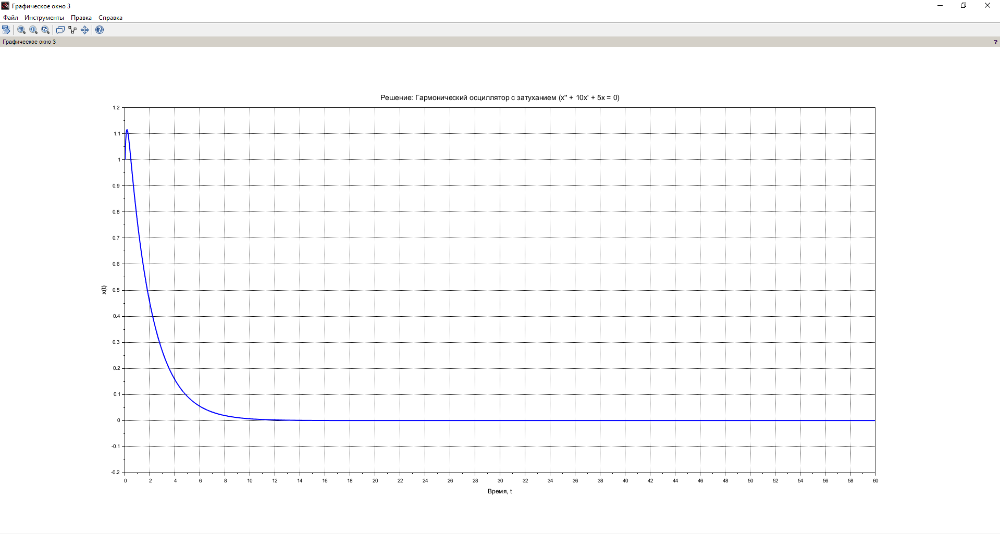
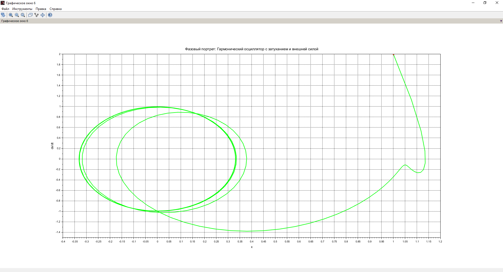

# Цель работы

Изучить уравнение гармонического осциллятора.

# Задание

1. Построить решение уравнения гармонического осциллятора без затухания.
2. Записать уравнение свободных колебаний гармонического осциллятора с затуханием, построить его решение. Построить фазовый портрет гармонических колебаний с затуханием.
3. Записать уравнение колебаний гармонического осциллятора, если на систему действует внешняя сила, построить его решение. Построить фазовый портрет колебаний с действием внешней силы.

# Выполнение лабораторной работы

## Теоретические сведения

Движение грузика на пружинке, маятника, заряда в электрическом контуре, а также эволюция во времени многих систем в физике, химии, биологии и других науках при определенных предположениях можно описать одним и тем же дифференциальным уравнением, которое в теории колебаний выступает в качестве основной модели. Эта модель называется линейным гармоническим осциллятором.

Уравнение свободных колебаний гармонического осциллятора имеет следующий вид:
\[
\ddot{x} + 2\gamma\dot{x} + \omega_0^2 x = 0
\]
где \( x \) — переменная, описывающая состояние системы (смещение грузика, заряд конденсатора и т.д.), \( \gamma \) — параметр, характеризующий потери энергии (трение в механической системе, сопротивление в контуре), \( \omega_0 \) — собственная частота колебаний.

При отсутствии потерь в системе (\( \gamma = 0 \)) получаем уравнение консервативного осциллятора, энергия колебания которого сохраняется во времени:
\[
\ddot{x} + \omega_0^2 x = 0
\]

Для однозначной разрешимости уравнения второго порядка необходимо задать два начальных условия вида:
\[
\begin{cases}
x(t_0) = x_0 \\
\dot{x}(t_0) = y_0
\end{cases}
\]

Уравнение второго порядка можно представить в виде системы двух уравнений первого порядка:
\[
\begin{cases}
\dot{x} = y \\
\dot{y} = -\omega_0^2 x
\end{cases}
\]

Начальные условия для системы примут вид:
\[
\begin{cases}
x(t_0) = x_0 \\
y(t_0) = y_0
\end{cases}
\]

Независимые переменные \( x, y \) определяют пространство, в котором «движется» решение. Это фазовое пространство системы, поскольку оно двумерно, будем называть его фазовой плоскостью. Значение фазовых координат \( x, y \) в любой момент времени полностью определяет состояние системы. Решению уравнения движения как функции времени отвечает гладкая кривая в фазовой плоскости, называемая фазовой траекторией. Набор фазовых траекторий для различных начальных условий формирует фазовый портрет.

## Задача

Постройте фазовый портрет гармонического осциллятора и решение уравнения гармонического осциллятора для следующих случаев:

1. Колебания гармонического осциллятора без затухания и без действия внешней силы:
\[
\ddot{x} + 12x = 0
\]
2. Колебания гармонического осциллятора с затуханием и без действия внешней силы:
\[
\ddot{x} + 10\dot{x} + 5x = 0
\]
3. Колебания гармонического осциллятора с затуханием и под действием внешней силы:
\[
\ddot{x} + 7\dot{x} + 7x = 7\sin(3t)
\]

На интервале \( t \in [0; 60] \), шаг 0.05, \( x_0 = -0.1 \), \( y_0 = 1.2 \).

### Решение в Scilab

```scilab
// Параметры осциллятора
w1 = sqrt(12);  // Собственная частота для модели 1 (ω^2 = 12)
w2 = sqrt(5);   // Собственная частота для модели 2 (ω^2 = 5)
w3 = sqrt(7);   // Собственная частота для модели 3 (ω^2 = 7)
g2 = 10;        // Коэффициент затухания для модели 2 (2γ = 10 → γ = 5)
g3 = 7;         // Коэффициент затухания для модели 3 (2γ = 7 → γ = 3.5)
f0 = 7;         // Амплитуда внешней силы для модели 3
wf = 3;         // Частота внешней силы

// Начальные условия
x0 = -0.1;      // Начальное смещение
v0 = 1.2;       // Начальная скорость
y0 = [x0; v0];  // Вектор начальных условий
t0 = 0;         // Начальное время
t = linspace(0, 60, 60/0.05 + 1); // Временной интервал [0, 60] с шагом 0.05

// Уравнение внешней силы f(t) = 7 * sin(3t)
function f = external_force(t)
    f = f0 * sin(wf * t);
endfunction

// Модель 1: Гармонический осциллятор без затухания (ddot{x} + 12x = 0)
function dydt = model1(t, y)
    x = y(1);
    v = y(2);
    dx_dt = v;
    dv_dt = -w1^2 * x;
    dydt = [dx_dt; dv_dt];
endfunction

// Модель 2: Гармонический осциллятор с затуханием (ddot{x} + 10\dot{x} + 5x = 0)
function dydt = model2(t, y)
    x = y(1);
    v = y(2);
    dx_dt = v;
    dv_dt = -w2^2 * x - g2 * v;
    dydt = [dx_dt; dv_dt];
endfunction

// Модель 3: Гармонический осциллятор с затуханием и внешней силой (ddot{x} + 7\dot{x} + 7x = 7sin(3t))
function dydt = model3(t, y)
    x = y(1);
    v = y(2);
    dx_dt = v;
    dv_dt = -w3^2 * x - g3 * v + external_force(t);
    dydt = [dx_dt; dv_dt];
endfunction

// Решение дифференциальных уравнений
solution1 = ode(y0, t0, t, model1); // Без затухания
solution2 = ode(y0, t0, t, model2); // С затуханием
solution3 = ode(y0, t0, t, model3); // С внешней силой

// Извлечение смещений и скоростей
x1 = solution1(1,:); v1 = solution1(2,:); // Модель 1
x2 = solution2(1,:); v2 = solution2(2,:); // Модель 2
x3 = solution3(1,:); v3 = solution3(2,:); // Модель 3

// Построение графиков смещений x(t)
scf(1); clf();
subplot(3,1,1);
plot(t, x1, 'b');
xtitle('Модель 1: Без затухания (ddot{x} + 12x = 0)', 'Время t', 'Смещение x(t)');
xgrid();

subplot(3,1,2);
plot(t, x2, 'r');
xtitle('Модель 2: С затуханием (ddot{x} + 10\dot{x} + 5x = 0)', 'Время t', 'Смещение x(t)');
xgrid();

subplot(3,1,3);
plot(t, x3, 'g');
xtitle('Модель 3: С внешней силой (ddot{x} + 7\dot{x} + 7x = 7sin(3t))', 'Время t', 'Смещение x(t)');
xgrid();

// Построение фазовых портретов
scf(2); clf();
subplot(3,1,1);
plot(x1, v1, 'b');
xtitle('Фазовый портрет: Без затухания', 'Смещение x', 'Скорость v');
xgrid();

subplot(3,1,2);
plot(x2, v2, 'r');
xtitle('Фазовый портрет: С затуханием', 'Смещение x', 'Скорость v');
xgrid();

subplot(3,1,3);
plot(x3, v3, 'g');
xtitle('Фазовый портрет: С внешней силой', 'Смещение x', 'Скорость v');
xgrid();

// Вывод уравнений
disp("Уравнения:");
disp("Модель 1 (без затухания): ddot{x} + 12x = 0");
disp("Модель 2 (с затуханием): ddot{x} + 10dot{x} + 5x = 0");
disp("Модель 3 (с внешней силой): ddot{x} + 7dot{x} + 7x = 7sin(3t)");


{ #fig:001 width=70% height=70% }
{ #fig:002 width=70% height=70% }
{ #fig:003 width=70% height=70% }
{ #fig:004 width=70% height=70% }
{ #fig:005 width=70% height=70% }
{ #fig:006 width=70% height=70% }
