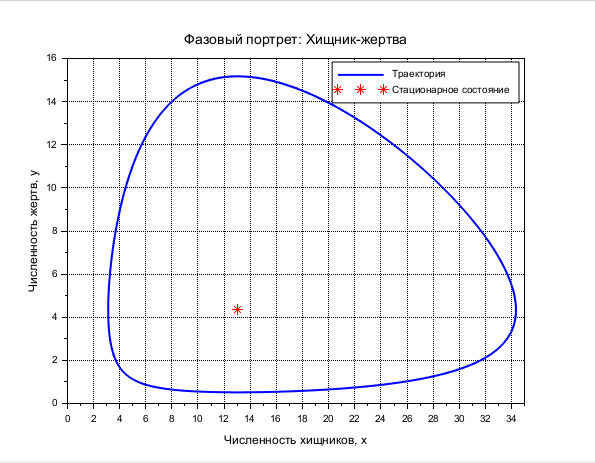
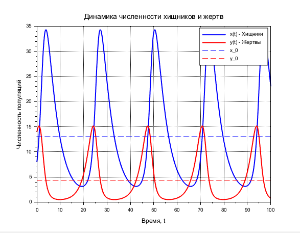

---
# Front matter
lang: ru-RU
title: "Отчет по лабораторной работе №5"
subtitle: "Модель хищник-жертва - вариант 11"
author: "Зиязетдинов Алмаз"

# Formatting
toc-title: "Содержание"
toc: true # Table of contents
toc_depth: 2
lof: true # List of figures
fontsize: 12pt
linestretch: 1.5
papersize: a4paper
documentclass: scrreprt
polyglossia-lang: russian
polyglossia-otherlangs: english
mainfont: PT Serif
romanfont: PT Serif
sansfont: PT Sans
monofont: PT Mono
mainfontoptions: Ligatures=TeX
romanfontoptions: Ligatures=TeX
sansfontoptions: Ligatures=TeX,Scale=MatchLowercase
monofontoptions: Scale=MatchLowercase
indent: true
pdf-engine: lualatex
header-includes:
  - \linepenalty=10 # the penalty added to the badness of each line within a paragraph (no associated penalty node) Increasing the υalue makes tex try to haυe fewer lines in the paragraph.
  - \interlinepenalty=0 # υalue of the penalty (node) added after each line of a paragraph.
  - \hyphenpenalty=50 # the penalty for line breaking at an automatically inserted hyphen
  - \exhyphenpenalty=50 # the penalty for line breaking at an explicit hyphen
  - \binoppenalty=700 # the penalty for breaking a line at a binary operator
  - \relpenalty=500 # the penalty for breaking a line at a relation
  - \clubpenalty=150 # extra penalty for breaking after first line of a paragraph
  - \widowpenalty=150 # extra penalty for breaking before last line of a paragraph
  - \displaywidowpenalty=50 # extra penalty for breaking before last line before a display math
  - \brokenpenalty=100 # extra penalty for page breaking after a hyphenated line
  - \predisplaypenalty=10000 # penalty for breaking before a display
  - \postdisplaypenalty=0 # penalty for breaking after a display
  - \floatingpenalty = 20000 # penalty for splitting an insertion (can only be split footnote in standard LaTeX)
  - \raggedbottom # or \flushbottom
  - \usepackage{float} # keep figures where there are in the text
  - \floatplacement{figure}{H} # keep figures where there are in the text
---

# Цель работы

Изучить модель хищник-жертва

# Задание

1.	Построить график зависимости $x$ от $y$ и графики функций $x(t)$, $y(t)$
2.	Найти стационарное состояние системы


# Выполнение лабораторной работы

## Теоретические сведения

В данной лабораторной работе рассматривается математическая модель системы «Хищник-жертва». 

Рассмотрим базисные компоненты системы. 
Пусть система имеет $X$ хищников и $Y$ жертв. И пусть для этой системы выполняются следующие предположения: (Модель Лотки-Вольтерра)
1.	Численность популяции жертв и хищников зависят только от времени (модель не учитывает пространственное распределение популяции на занимаемой территории) 
2.	В отсутствии взаимодействия численность видов изменяется по модели Мальтуса, при этом число жертв увеличивается, а число хищников падает 
3.	Естественная смертность жертвы и естественная рождаемость хищника считаются несущественными 
4.	Эффект насыщения численности обеих популяций не учитывается 
5.	Скорость роста численности жертв уменьшается пропорционально численности хищников:

$$
 \begin{cases}
	\frac{dx}{dt} = (-ax(t) + by(t)x(t))
	\\   
	\frac{dy}{dt} = (cy(t) - dy(t)x(t))
 \end{cases}
$$

Параметр $a$ определяет коэффициент смертности хищников, $b$ – коэффициент естественного прироста хищников, $c$ – коэффициент прироста жертв и $d$ – коэффициент смертности жертв

В зависимости от этих параметрах система и будет изменяться. Однако следует выделить одно важное состояние системы, при котором не происходит никаких изменений как со стороны хищников, так и со стороны жертв. Это, так называемое, стационарное состояние системы. При нем, как уже было отмечено, изменение численности популяции равно нулю.
Следовательно, при отсутствии изменений в системе $\frac{dx}{dt} = 0, \frac{dy}{dt} = 0$

Пусть по условию есть хотя бы один хищник и хотя бы одна жертва: $x>0, y>0$
Тогда стационарное состояние системы определяется следующим образом: 
$$
	x_0=\frac{a}{b}, y_0=\frac{c}{d}
$$

## Задача

Для модели «хищник-жертва»:

$$
 \begin{cases}
	\frac{dx}{dt} = -0.23x(t) + 0.053y(t)x(t)
	\\   
	\frac{dy}{dt} = 0.43y(t) - 0.033y(t)x(t)
 \end{cases}
$$

Постройте график зависимости численности хищников от численности жертв, а также графики изменения численности хищников и численности жертв 
при следующих начальных условиях: $x_0=8, y_0=14$
Найдите стационарное состояние системы

Решение в Scilab

```
// Параметры модели
a = 0.23;  // Коэффициент смертности хищников
b = 0.053; // Коэффициент прироста хищников
c = 0.43;  // Коэффициент прироста жертв
d = 0.033; // Коэффициент смертности жертв

// Начальные условия
x0 = 8;    // Начальная численность хищников
y0 = 14;   // Начальная численность жертв
u0 = [x0; y0];

// Временной интервал
t0 = 0; tfinal = 100; dt = 0.1;
t = t0:dt:tfinal;

// Уравнения модели Лотки-Вольтерры
function du = lotka_volterra(t, u)
    x = u(1); y = u(2);
    du = zeros(2,1);
    du(1) = -a*x + b*y*x;     // dx/dt
    du(2) = c*y - d*y*x;      // dy/dt
endfunction

// Решение системы дифференциальных уравнений
u = ode(u0, t0, t, lotka_volterra);
x = u(1,:); y = u(2,:);

// Вычисление стационарного состояния
x_stat = c/d; // ≈ 13.0303
y_stat = a/b; // ≈ 4.3396
disp("Стационарное состояние: x_0 = " + string(x_stat) + ", y_0 = " + string(y_stat));

// График 1: Фазовый портрет (x(y))
scf(1);
plot(x, y, 'b-', 'LineWidth', 2);
plot(x_stat, y_stat, 'r*', 'MarkerSize', 10); // Стационарная точка
xlabel('Численность хищников, x');
ylabel('Численность жертв, y');
title('Фазовый портрет: Хищник-жертва');
legend(['Траектория'; 'Стационарное состояние']);
xgrid;

// График 2: x(t) и y(t)
scf(2);
plot(t, x, 'b-', 'LineWidth', 2);
plot(t, y, 'r-', 'LineWidth', 2);
plot(t, x_stat*ones(t), 'b--', 'LineWidth', 1); // Линия x_0
plot(t, y_stat*ones(t), 'r--', 'LineWidth', 1); // Линия y_0
xlabel('Время, t');
ylabel('Численность популяций');
title('Динамика численности хищников и жертв');
legend(['x(t) - Хищники'; 'y(t) - Жертвы'; 'x_0'; 'y_0']);
xgrid;
```

{ #fig:001 width=70% height=70% }

{ #fig:002 width=70% height=70% }


# Выводы

В ходе выполнения лабораторной работы была изучена модель хищник-жертва и построены графики.

# Список литературы {.unnumbered}

1. [Модель Лотки-Вольтерры](https://math-it.petrsu.ru/users/semenova/MathECO/Lections/Lotka_Volterra.pdf)
2. [Lotka-Volterra System](https://www.sciencedirect.com/topics/mathematics/lotka-volterra-system)
