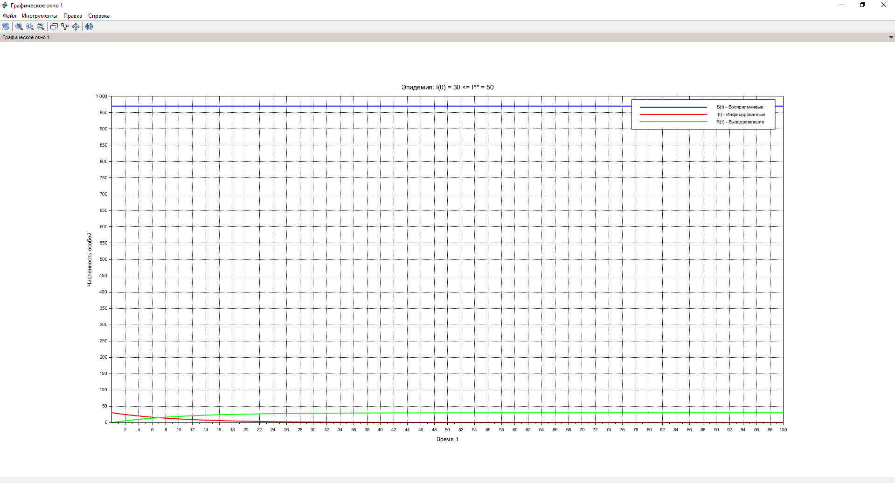
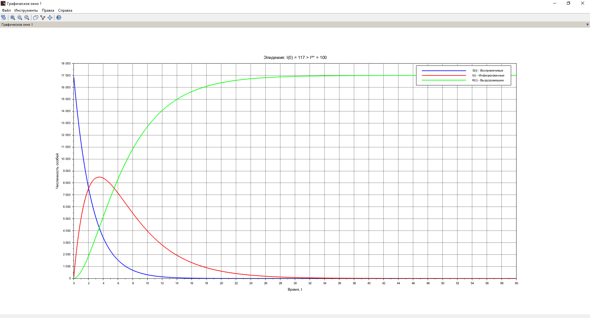

---
# Front matter
lang: ru-RU
title: "Отчет по лабораторной работе №6"
subtitle: "Модель эпидемии - вариант 11"
author: "Зиязетдинов Алмаз"

# Formatting
toc-title: "Содержание"
toc: true # Table of contents
toc_depth: 2
lof: true # List of figures
fontsize: 12pt
linestretch: 1.5
papersize: a4paper
documentclass: scrreprt
polyglossia-lang: russian
polyglossia-otherlangs: english
mainfont: PT Serif
romanfont: PT Serif
sansfont: PT Sans
monofont: PT Mono
mainfontoptions: Ligatures=TeX
romanfontoptions: Ligatures=TeX
sansfontoptions: Ligatures=TeX,Scale=MatchLowercase
monofontoptions: Scale=MatchLowercase
indent: true
pdf-engine: lualatex
header-includes:
  - \linepenalty=10 # the penalty added to the badness of each line within a paragraph (no associated penalty node) Increasing the υalue makes tex try to haυe fewer lines in the paragraph.
  - \interlinepenalty=0 # υalue of the penalty (node) added after each line of a paragraph.
  - \hyphenpenalty=50 # the penalty for line breaking at an automatically inserted hyphen
  - \exhyphenpenalty=50 # the penalty for line breaking at an explicit hyphen
  - \binoppenalty=700 # the penalty for breaking a line at a binary operator
  - \relpenalty=500 # the penalty for breaking a line at a relation
  - \clubpenalty=150 # extra penalty for breaking after first line of a paragraph
  - \widowpenalty=150 # extra penalty for breaking before last line of a paragraph
  - \displaywidowpenalty=50 # extra penalty for breaking before last line before a display math
  - \brokenpenalty=100 # extra penalty for page breaking after a hyphenated line
  - \predisplaypenalty=10000 # penalty for breaking before a display
  - \postdisplaypenalty=0 # penalty for breaking after a display
  - \floatingpenalty = 20000 # penalty for splitting an insertion (can only be split footnote in standard LaTeX)
  - \raggedbottom # or \flushbottom
  - \usepackage{float} # keep figures where there are in the text
  - \usepackage{amsmath}
  - \floatplacement{figure}{H} # keep figures where there are in the text
---

# Цель работы

Изучить модель эпидемии $SIR$

# Задание

1.	Изучить модель эпидемии
2.	Построить графики изменения числа особей в каждой из трех групп. Рассмотреть, как будет протекать эпидемия в случае: $I(0)\leq I^*$, $I(0)>I^*$


# Выполнение лабораторной работы

## Теоретические сведения

Рассмотрим простейшую модель эпидемии. Предположим, что некая популяция, состоящая из $N$ особей, (считаем, что популяция изолирована) подразделяется на три группы. Первая группа - это восприимчивые к болезни, но пока здоровые особи, обозначим их через $S(t)$. Вторая группа – это число инфицированных особей, которые также при этом являются распространителями инфекции, обозначим их $I(t)$. А третья группа, обозначающаяся через $R(t)$ – это здоровые особи с иммунитетом к болезни. 
До того, как число заболевших не превышает критического значения $I^*$, считаем, что все больные изолированы и не заражают здоровых. Когда $I(t)> I^*$, тогда инфицирование способны заражать восприимчивых к болезни особей. 

Таким образом, скорость изменения числа $S(t)$ меняется по следующему закону:

$$
\frac{dS}{dt}=
 \begin{cases}
  -\alpha S &\text{,если $I(t) > I^*$}
  \\   
  0 &\text{,если $I(t) \leq I^*$}
 \end{cases}
$$

Поскольку каждая восприимчивая к болезни особь, которая, в конце концов, заболевает, сама становится инфекционной, то скорость изменения числа инфекционных особей представляет разность за единицу времени между заразившимися и теми, кто уже болеет и лечится. Т.е.:

$$
\frac{dI}{dt}=
 \begin{cases}
  \alpha S -\beta I &\text{,если $I(t) > I^*$}
  \\   
  -\beta I &\text{,если $I(t) \leq I^*$}
 \end{cases}
$$

А скорость изменения выздоравливающих особей (при этом приобретающие иммунитет к болезни):

$$\frac{dR}{dt} = \beta I$$

Постоянные пропорциональности $\alpha, \beta$ - это коэффициенты заболеваемости и выздоровления соответственно. Для того, чтобы решения соответствующих уравнений определялось однозначно, необходимо задать начальные условия. Считаем, что на начало эпидемии в момент времени $t=0$ нет особей с иммунитетом к болезни $R(0)=0$, а число инфицированных и восприимчивых к болезни особей $I(0)$ и $S(0)$ соответственно. Для анализа картины протекания эпидемии необходимо рассмотреть два случая:  $I(0) \leq I^*$ и  $I(0)>I^*$

## Задача

На одном острове вспыхнула эпидемия. Известно, что из всех проживающих на острове 
$N=17000$ в момент начала эпидемии $(t=0)$ число заболевших людей 
(являющихся распространителями инфекции) $I(0)=117$, А число здоровых людей с иммунитетом 
к болезни $R(0)=17$. Таким образом, число людей восприимчивых к болезни, 
но пока здоровых, в начальный момент времени $S(0)=N-I(0)-R(0)$.
Постройте графики изменения числа особей в каждой из трех групп.

Рассмотрите, как будет протекать эпидемия в случае:
1.	$I(0)\leq I^*$
2.	$I(0)>I^*$

Решение в Scilab

```
// Параметры модели
N = 17000;    // Общая популяция
alpha = 0.4;  // Коэффициент заболеваемости
beta = 0.2;   // Коэффициент выздоровления
I_star = 100; // Критическое число инфицированных

// Временной интервал
t0 = 0;       // Начальное время
tfinal = 60;  // Конечное время
dt = 0.1;     // Шаг времени
t = t0:dt:tfinal; // Вектор времени

// Определение системы уравнений
function du = epidemic_model(t, u)
    S = u(1); // Восприимчивые
    I = u(2); // Инфицированные
    R = u(3); // Выздоровевшие
    du = zeros(3,1);
    if I > I_star then
        du(1) = -alpha*S;       // dS/dt
        du(2) = alpha*S - beta*I; // dI/dt
    else
        du(1) = 0;              // dS/dt
        du(2) = -beta*I;        // dI/dt
    end
    du(3) = beta*I;           // dR/dt
endfunction

// --- Случай 1: I(0) = 117 > I_star = 100 ---
S0_1 = 16866; // Начальное число восприимчивых: N - I(0) - R(0)
I0_1 = 117;   // Начальное число инфицированных
R0_1 = 17;    // Начальное число выздоровевших
u0_1 = [S0_1; I0_1; R0_1];

// Решение для случая 1
u_1 = ode(u0_1, t0, t, epidemic_model);
S_1 = u_1(1,:); // S(t)
I_1 = u_1(2,:); // I(t)
R_1 = u_1(3,:); // R(t)

// График для случая 1
scf(1);
plot(t, S_1, 'b-', 'LineWidth', 2); // Восприимчивые
plot(t, I_1, 'r-', 'LineWidth', 2); // Инфицированные
plot(t, R_1, 'g-', 'LineWidth', 2); // Выздоровевшие
xlabel('Время, t');
ylabel('Численность особей');
title('Эпидемия: I(0) = 117 > I^* = 100');
legend(['S(t) - Восприимчивые'; 'I(t) - Инфицированные'; 'R(t) - Выздоровевшие']);
xgrid;

// --- Случай 2: I(0) = 50 <= I_star = 100 ---
S0_2 = 16933; // Начальное число восприимчивых: N - I(0) - R(0)
I0_2 = 50;    // Начальное число инфицированных
R0_2 = 17;    // Начальное число выздоровевших
u0_2 = [S0_2; I0_2; R0_2];

// Решение для случая 2
u_2 = ode(u0_2, t0, t, epidemic_model);
S_2 = u_2(1,:); // S(t)
I_2 = u_2(2,:); // I(t)
R_2 = u_2(3,:); // R(t)

// График для случая 2
scf(2);
plot(t, S_2, 'b-', 'LineWidth', 2); // Восприимчивые
plot(t, I_2, 'r-', 'LineWidth', 2); // Инфицированные
plot(t, R_2, 'g-', 'LineWidth', 2); // Выздоровевшие
xlabel('Время, t');
ylabel('Численность особей');
title('Эпидемия: I(0) = 50 <= I^* = 100');
legend(['S(t) - Восприимчивые'; 'I(t) - Инфицированные'; 'R(t) - Выздоровевшие']);
xgrid;
```

{ #fig:001 width=70% height=70% }

{ #fig:002 width=70% height=70% }


# Выводы

В ходе выполнения лабораторной работы была изучена модель эпидемии и построены графики.

# Список литературы {.unnumbered}

1. [Конструирование эпидемиологических моделей](https://habr.com/ru/post/551682/)
2. [Зараза, гостья наша](https://nplus1.ru/material/2019/12/26/epidemic-math)
